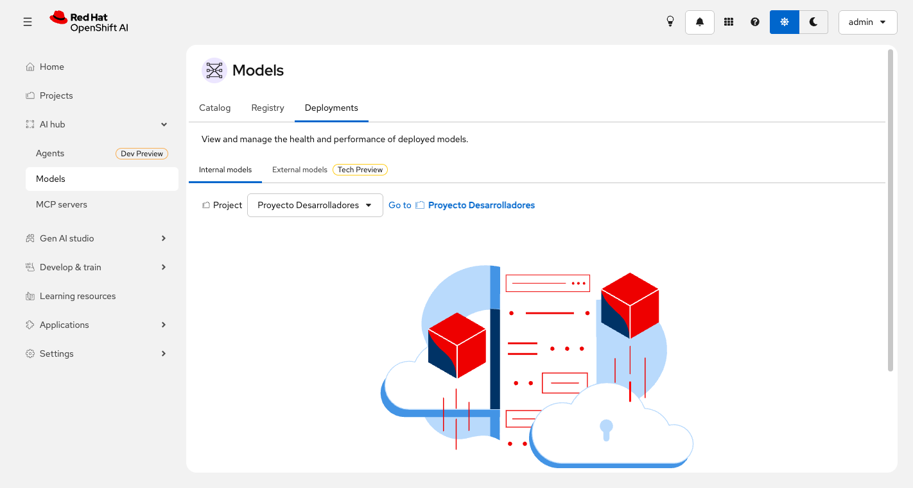
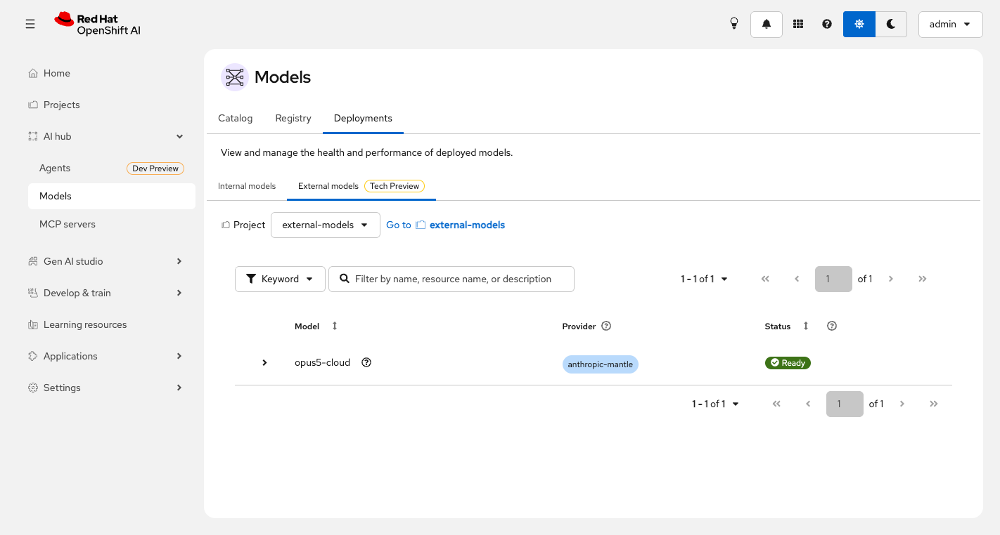
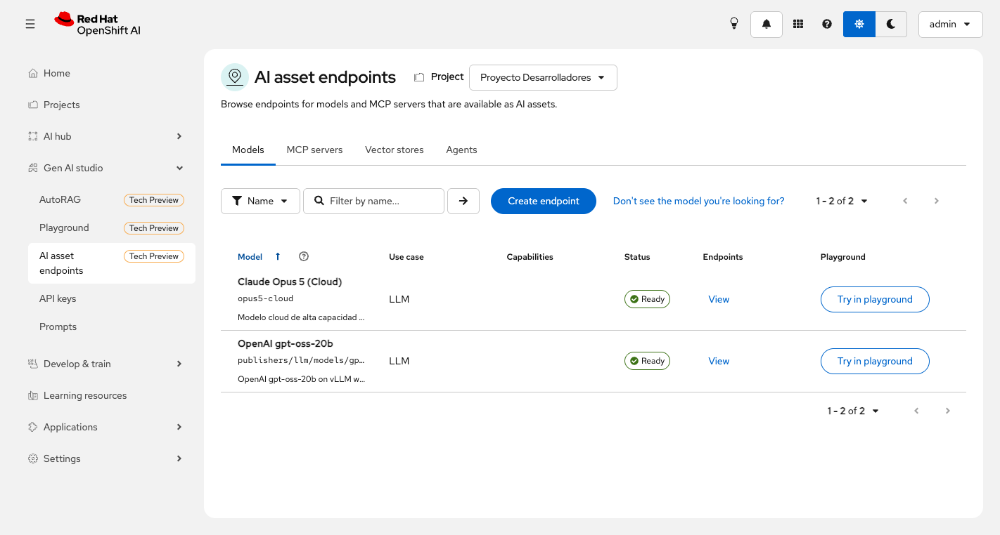
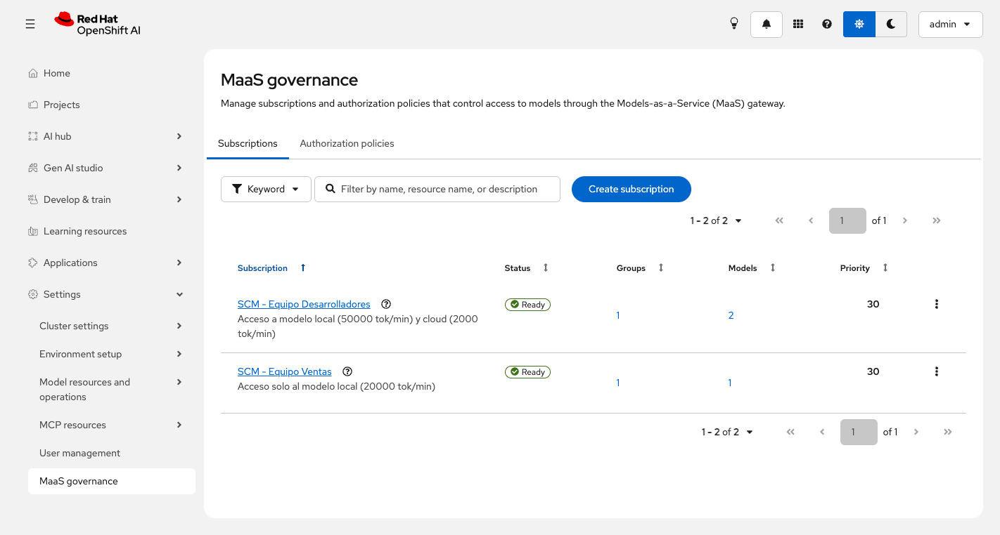
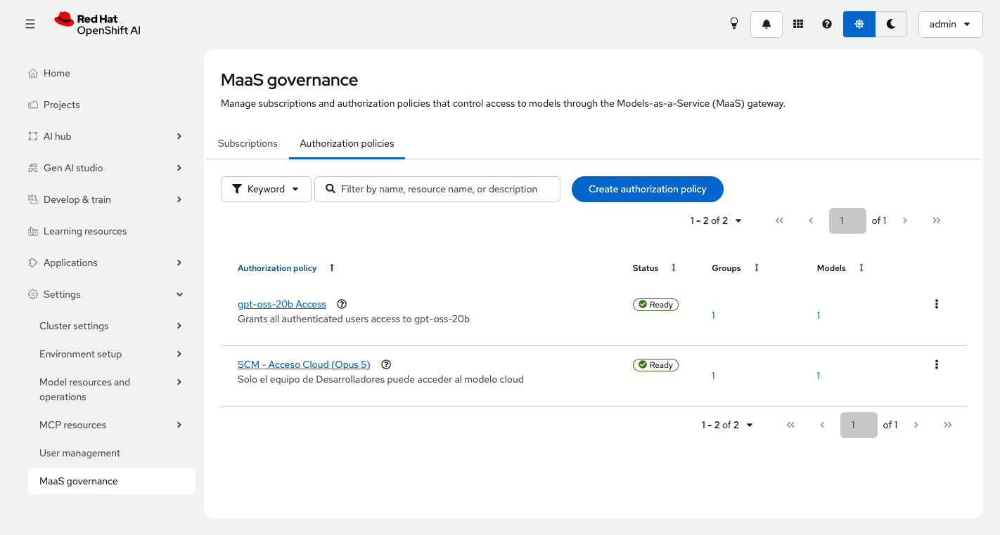
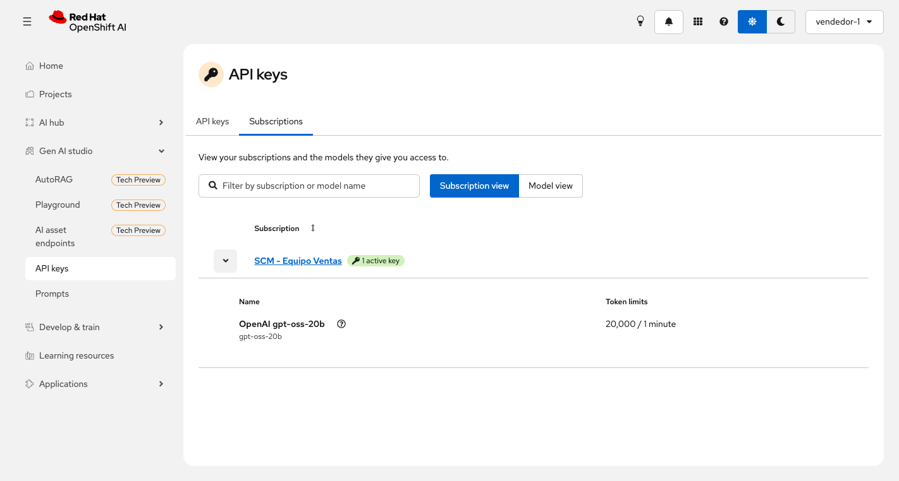
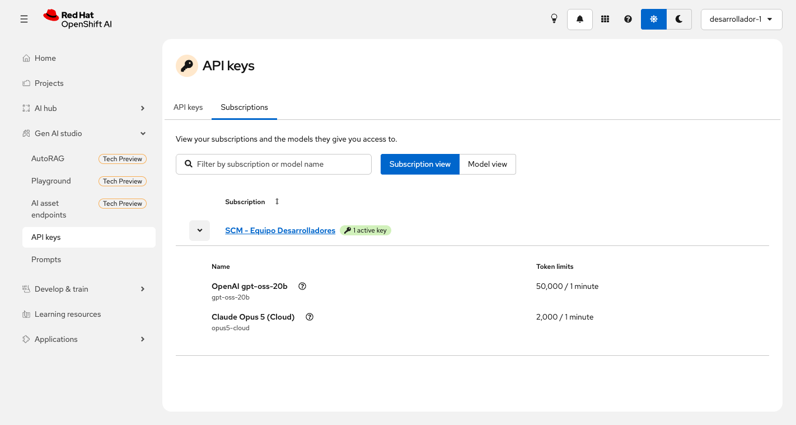
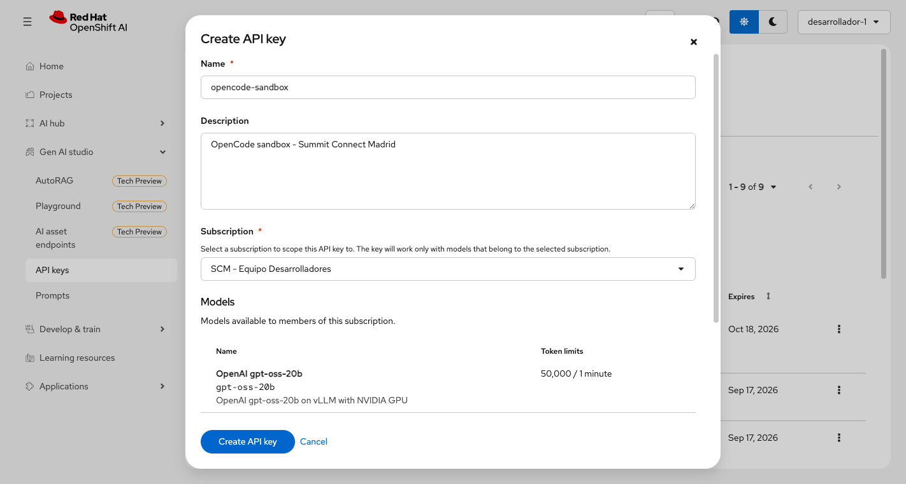
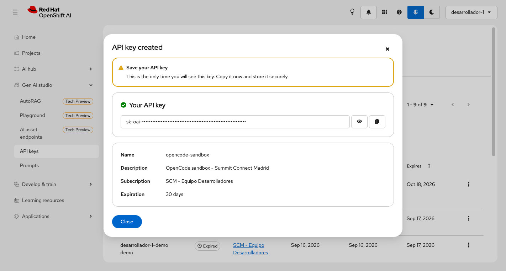
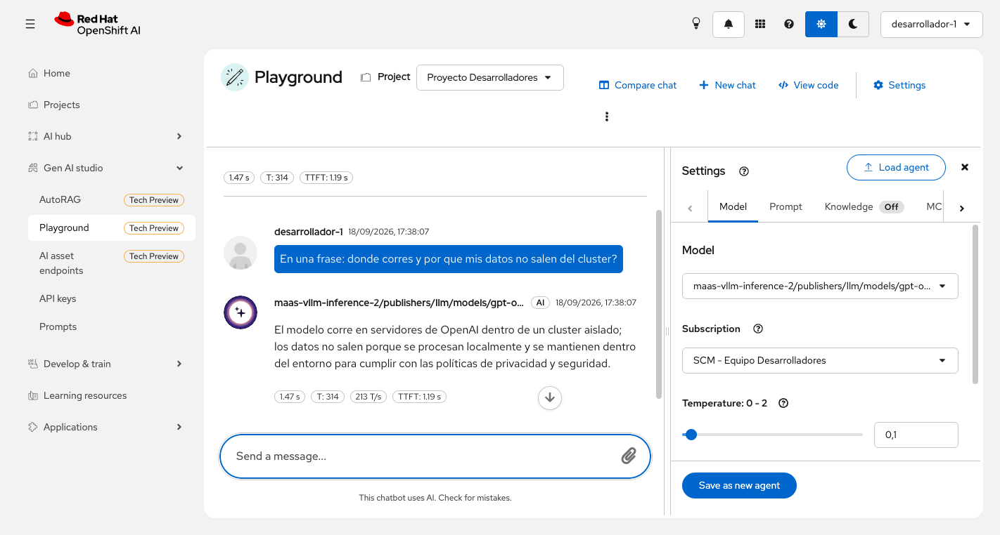

# Summit Connect Madrid - Model-As-A-Service: facilitando el acceso a modelos gobernados

## Abstract

Descubre cómo Red Hat MaaS (GA) democratiza la IA empresarial. Demo en vivo: despliegue ágil de modelos, soberanía de datos e inferencia escalable. / Build with private AI at scale: use Red Hat OpenShift AI MaaS to power code assistants, MCP-driven agents, and real-time usage insights.

---

Model as a Service: acceso gobernado a modelos de IA - local y cloud - con Red Hat OpenShift AI.

Demo de 20 minutos en el estadio del Atletico de Madrid.

> **Regla de la demo**: todo lo de MaaS se hace desde la **UI de RHOAI** (`https://rh-ai.<domain>`).
> La terminal solo aparece dentro del sandbox, y alli se usa **OpenCode**, no `curl`.

## La historia

Una empresa tiene dos equipos que necesitan modelos de IA: **Desarrolladores** y **Ventas**. El CIO tiene tres prioridades:

1. **Soberania de datos**: hay un modelo local (gpt-oss-20b) en GPU propia; los datos no salen del cluster.
2. **Potencia cuando se necesita**: un modelo cloud (Claude Opus 5) disponible bajo demanda.
3. **Control de costes**: el cloud es caro. Solo Desarrolladores lo usa, y con limites estrictos.

La plataforma lo garantiza: nadie tiene que "portarse bien" manualmente.

## Arquitectura

```
                    ┌─────────────────────────────────────────┐
                    │            MaaS Gateway                 │
                    │   maas.apps.ocp.xxx.opentlc.com         │
                    └──────────┬───────────────┬──────────────┘
                               │               │
                    ┌──────────▼──────┐  ┌─────▼──────────────┐
                    │  gpt-oss-20b    │  │  opus5-cloud       │
                    │  (GPU local)    │  │  (Cloud - Opus 5)  │
                    │  namespace: llm │  │  ns: external-     │
                    │  vLLM en L40S   │  │      models        │
                    └─────────────────┘  └────────────────────┘
```

## Matriz de acceso

| Equipo | gpt-oss-20b (local) | opus5-cloud (cloud) |
|--------|:-------------------:|:-------------------:|
| **Desarrolladores** | 50k tok/min | 2k tok/min |
| **Ventas** | 20k tok/min | Sin acceso (403) |
| **admin** (presentador) | 50k tok/min | 2k tok/min |

El limite del cloud es 25x mas bajo que el del local, y esta puesto bajo a proposito: con 2.000 tokens/min
dos o tres peticiones reales de OpenCode ya devuelven **429**, que es lo que hay que ver en directo. El CIO
controla el gasto sin quitar funcionalidad.

> `admin` esta incluido a proposito: en MaaS la visibilidad de modelos va por **suscripcion + politica de
> autorizacion**, no por ser cluster-admin. Si el presentador no esta en ninguna suscripcion, la UI de MaaS
> le muestra **cero modelos**. Ver [Troubleshooting](#troubleshooting).

---

## Preparacion (antes de la demo)

### 1. GPU y plataforma MaaS (~45 min)

```bash
oc login https://api.ocp.<cluster>.opentlc.com:6443 -u admin -p <password>

# GPU MachineSet (g6e.xlarge para L40S)
cd ocp-gpu-setup && ./machine-set/gpu-machineset.sh

# MaaS + observabilidad
cd rhoai-maas-guide && ./scripts/setup-maas.sh --with-observability
```

### 2. Modelo local gpt-oss-20b

Los manifests viven en este repo (`manifests/01-models/gpt-oss-20b/`, copiados de
[rhoai-maas-guide](https://github.com/rh-aiservices-bu/rhoai-maas-guide/tree/main/manifests/05-maas-models/gpt-oss-20b)):

```bash
oc apply -k manifests/01-models/gpt-oss-20b/llm    # LLMInferenceService (vLLM CUDA, 1 GPU)
oc apply -k manifests/01-models/gpt-oss-20b/maas   # MaaSModelRef + auth policy + suscripciones base
oc get llminferenceservice -n llm -w      # espera READY=True (~10 min, descarga modelcar 8GB)
```

### 3. Clave ABSK para el modelo cloud (~5 min)

**La ABSK caduca.** Si la demo se preparo hace mas de un dia, hay que regenerarla o el modelo cloud
devolvera `401 authentication_error` (el error viene de Anthropic, no de MaaS).

```bash
export AWS_ACCESS_KEY_ID=<key> AWS_SECRET_ACCESS_KEY=<secret>
cd z-collateral
./provision-bedrock-anthropic.sh --models anthropic.claude-opus-5 --region us-east-1

# refrescar el secret que usa el ExternalProvider
oc create secret generic anthropic-mantle-api-key -n external-models \
  --from-literal=api-key='ABSK...' --dry-run=client -o yaml | oc apply -f -
oc label secret anthropic-mantle-api-key -n external-models inference.llm-d.ai/ipp-managed=true --overwrite
```

### 4. Desplegar la demo (~5 min)

```bash
DEMO_PASSWORD='redhat123' ABSK_KEY='ABSK...' ./scripts/setup-demo.sh
```

Crea usuarios (`desarrollador-1`, `vendedor-1`), grupos, el modelo externo, las politicas y las suscripciones.

### 5. Sandbox con OpenCode (~10 min)

```bash
./scripts/install-openshell.sh
```

Genera la API key del sandbox **en la UI** (Gen AI studio → API keys → Create API key, ver Acto 3) y luego:

```bash
MAAS_API_KEY='sk-oai-...' ./scripts/setup-sandbox.sh
```

### 6. Comprobacion previa (obligatoria)

```bash
./scripts/check-demo.sh
```

Valida los cuatro fallos que rompen la demo en directo: modelo local caido, ABSK caducada,
API key de MaaS caducada y politica del sandbox que bloquea a OpenCode.

---

## Guion de la demo (20 minutos)

### Acto 1 - El problema del CIO (3 min)

> "Sois el CIO. Dos equipos, dos modelos: uno local en vuestras GPUs, otro en la nube. El local es seguro
> pero limitado. El cloud es potente pero caro. Como dais acceso a cada equipo con garantias?"

Nada que clicar todavia. Solo la diapositiva.

### Acto 2 - Dos modelos, dos mundos (4 min)

**UI**: `AI hub` → `Models` → pestaña `Deployments`.

Sub-pestaña **Internal models**: el modelo local, servido con llm-d sobre GPU.



Sub-pestaña **External models** (Tech Preview) → en el selector **Project** elige `external-models`:
aparece `opus5-cloud` con su provider `anthropic-mantle` en estado `Ready`.



**UI**: `Gen AI studio` → `AI asset endpoints` → proyecto `sandbox-scm`. Los dos modelos, en la misma lista,
con el mismo ciclo de vida y el mismo endpoint de gateway:



> "Local y cloud son el mismo tipo de activo para la plataforma. La gobernanza no distingue donde corre el modelo."

### Acto 3 - Gobernanza como politica (6 min)

**UI**: `Settings` → `MaaS governance` → pestaña `Subscriptions`. Una suscripcion por equipo, con su limite:



Pestaña `Authorization policies`: quien puede acceder a que. `gpt-oss-20b` para todos los autenticados,
`opus5-cloud` solo para el grupo `scm-desarrolladores`:



Ahora el mismo cluster, visto por cada equipo. **Logout** y entra con el IdP `scm-demo`.

`vendedor-1` (`redhat123`) → `Gen AI studio` → `API keys` → pestaña `Subscriptions` → despliega la fila:
**un modelo**, 20.000 tok/min.



`desarrollador-1` (`redhat123`), misma pantalla: **dos modelos**, 50.000 y 10.000 tok/min.



> "Ventas ve un modelo. Desarrolladores ven dos. La misma plataforma, distintos permisos, cero configuracion
> en el cliente."

Como `desarrollador-1`, crea la API key del sandbox delante del publico:
`Create API key` → nombre `opencode-sandbox` → suscripcion `SCM - Equipo Desarrolladores`
(el dialogo muestra los modelos que la key va a poder usar) → `Expiration` 30 dias.





> "La key esta atada a la suscripcion. No es un secreto compartido con permisos infinitos: caduca, es
> revocable y solo abre los modelos de su suscripcion."

**Inferencia en vivo, sin terminal**: `Gen AI studio` → `Playground` → proyecto `Proyecto Desarrolladores`.
En `Settings` elige el modelo (`gpt-oss-20b` o `opus5-cloud`) y la suscripcion del equipo, y pregunta algo.
El panel muestra tokens y T/s, que es justo lo que la suscripcion esta limitando.



**Rate limiting en vivo**: en el mismo playground cambia el modelo a `opus5-cloud` y lanza dos o tres
preguntas seguidas. Con 2.000 tokens/min la suscripcion se agota enseguida y la UI devuelve el error del
gateway (`429 Too Many Requests`). Comportamiento verificado en este cluster bajando el limite a 300
tokens/min: la primera peticion devuelve `200` y de la segunda en adelante `429`.

> El 429 del modelo cloud solo se ve si la ABSK es valida: el contador de tokens se alimenta de las
> respuestas del proveedor, asi que con la ABSK caducada nunca se llega al limite (solo se ven 401/503).

> "Nadie ha tenido que portarse bien. El equipo puede pedir lo que quiera; el gasto lo corta la plataforma."

Si prefieres verlo en numeros, `./scripts/run-demo.sh` hace rafagas por equipo y resume `200 / 429 / 403`.

### Acto 4 - El sandbox del desarrollador (6 min)

> "El desarrollador no toca YAML ni claves. Abre su agente y trabaja."

Conecta al sandbox (una sola linea, y es la unica terminal de la demo):

```bash
openshell sandbox exec --gateway scm-demo --name opencode-scm --tty -- bash -l
```

Dentro, todo con **OpenCode**. La key de MaaS ya esta inyectada en el entorno, y los dos modelos estan
declarados como providers (`local/gpt-oss-20b` y `cloud/opus5-cloud`), asi que cambiar de modelo es
`/models` en el TUI o `--model` en la CLI:

```bash
opencode                      # TUI: /models para cambiar de modelo en caliente

# o sin abrir el TUI, modelo local (on-prem, soberania de datos):
opencode run --model local/gpt-oss-20b \
  "Escribe un script en bash que resuma los goles del Atletico de esta temporada leyendo as.com"

# el mismo prompt contra el modelo cloud (solo desarrolladores):
opencode run --model cloud/opus5-cloud \
  "Refactoriza ese script con manejo de errores y tests"
```

> "Mismo agente, dos modelos, una sola credencial de plataforma. El desarrollador elige potencia; el CIO
> sigue teniendo el limite de tokens."

**La red del sandbox tambien es politica.** En vez de `curl`, que lo pruebe el propio agente:

```bash
opencode run --model local/gpt-oss-20b \
  "Usa tu herramienta de fetch para leer https://as.com y dime si has podido acceder"

#   % WebFetch https://as.com
#   Access successful, content retrieved.

opencode run --model local/gpt-oss-20b \
  "Ahora haz lo mismo con https://marca.com"

#   ✗ WebFetch https://marca.com failed
#   Error: StatusCode: non 2xx status code (403 GET https://marca.com)
#   403 Forbidden - access was blocked.
```

(Salida real de este cluster: el agente accede a AS y recibe un 403 del **sandbox** al intentar Marca.)

> "Estamos en el estadio del Atletico. Aqui no se lee Marca."
>
> "En serio: es deny-by-default. La allowlist tiene el gateway de MaaS, npm, PyPI, GitHub en solo-lectura
> y as.com. Todo lo demas se bloquea en el sandbox, no en el destino. Y el agente no puede saltarselo
> porque la politica se aplica por binario y por metodo HTTP, fuera del proceso del agente."

### Cierre (30 seg)

> "Dos modelos, dos equipos, control total: soberania con el modelo local, potencia cloud bajo demanda,
> rate limiting para el coste y un sandbox deny-by-default para el agente. Todo declarativo, todo en
> OpenShift AI, y todo gestionable desde la consola."

---

## Playground por equipo

Cada equipo tiene su **proyecto** y es admin de el (`manifests/03-projects/team-projects.yaml`):

| Equipo | Proyecto | Admin |
|---|---|---|
| Desarrolladores | `desarrolladores-1-proyecto` | `desarrollador-1` + grupo `scm-desarrolladores` |
| Ventas | `ventas-1-proyecto` | `vendedor-1` + grupo `scm-ventas` |

El **Playground** de Gen AI studio es por proyecto y necesita un LlamaStack (`OGXServer`) desplegado en el:
sin el, `Add to playground` devuelve 500 y la pagina dice "You must create a project to begin".

Camino en la UI:

1. `Gen AI studio` → `AI asset endpoints` → selecciona el proyecto del equipo → `Add to playground`
   en cada modelo que quieras exponer.
2. `Gen AI studio` → `Playground` → selecciona el proyecto.
3. En `Settings` del playground: elige **Model** y **Subscription** (la suscripcion del equipo).


El playground pasa por el gateway de MaaS con la suscripcion del equipo, asi que la matriz de acceso se ve
sin tocar nada mas: en el proyecto de Ventas el modelo cloud no esta disponible; en el de Desarrolladores si.
Como plantilla declarativa de `OGXServer` hay `manifests/03-projects/playground-ogxserver.yaml.template`.

## Archivos del repositorio

```
manifests/
  01-models/                          Los dos modelos, uno por directorio
    gpt-oss-20b/                        Local, en GPU (kustomize, de rhoai-maas-guide)
      llm/                                LLMInferenceService (vLLM CUDA)
      maas/                               MaaSModelRef, auth policy y suscripciones base
    opus5-cloud/                        Cloud, via Bedrock-Mantle (aplicar en orden)
      00-namespace.yaml                   Namespace con labels de gateway
      01-secret-absk.yaml                 Secret de la ABSK (REPLACE_ME)
      02-external-provider.yaml           ExternalProvider (anthropic-mantle)
      03-external-model.yaml              ExternalModel: opus5-cloud
      04-maas-model-ref.yaml              MaaSModelRef que lo publica en el gateway
      05-httproute-compat.yaml            Compat HTTPRoute (fix del rewrite de ext-proc)
  02-governance/                      Quien accede a que, y con que limites
    auth-policies.yaml                  Cloud: grupo desarrolladores + admin
    subscriptions.yaml                  Limites por equipo (priority 30)
  03-projects/                        Espacio de trabajo de cada equipo
    team-projects.yaml                  desarrolladores-1-proyecto y ventas-1-proyecto
    playground-ogxserver.yaml.template   Plantilla de OGXServer para el playground
  04-sandbox/                         El agente y su jaula
    openshell-values.yaml               Helm values del gateway de OpenShell
    openshell-route.yaml                Route passthrough TLS (referencia)
    opencode-config.json                OpenCode: providers local/ y cloud/
    policy-scm.yaml.template            Politica del sandbox (as.com si, marca.com no)

scripts/
  setup-demo.sh                     Usuarios, grupos, modelo cloud, gobernanza, proyectos
  check-demo.sh                     Comprobacion previa (los fallos tipicos)
  run-demo.sh                       Matriz de acceso y rate limits (429)
  install-openshell.sh              Gateway de OpenShell
  setup-sandbox.sh                  Sandbox + OpenCode + politica de red
  cleanup-demo.sh                   Borrar todo
  common.sh                         Funciones compartidas

docs/images/                        Capturas de cada pantalla del guion
```

Los directorios de `manifests/` van numerados en el orden en que se aplican, y ese orden es el mismo
que el de los actos de la demo: primero los modelos, luego la gobernanza, luego los proyectos de cada
equipo y por ultimo el sandbox del agente.

---

## Troubleshooting

Los cuatro fallos reales que hemos visto en este cluster, con su sintoma exacto:

| Sintoma | Causa | Arreglo |
|---|---|---|
| La UI de MaaS muestra **0 modelos** al presentador; `/maas-api/v1/models` devuelve `{"data":[]}` | La visibilidad va por suscripcion + politica de autorizacion. Ser `cluster-admin` no da acceso | Añade el usuario a `spec.owner.users` de la suscripcion y a `spec.subjects.users` de la `MaaSAuthPolicy` (ojo: son listas de **strings**, no de objetos). Ya incluido en `02-governance/subscriptions.yaml` y `02-governance/auth-policies.yaml` |
| En **External models** no aparece `opus5-cloud` | El selector **Project** esta en `ai-tenants` | Cambia el proyecto a `external-models` |
| El modelo cloud devuelve `401 authentication_error` con `"type":"error"` de Anthropic | La **ABSK** del `ExternalProvider` ha caducado. MaaS enruta bien; el 401 lo da el proveedor | Regenera la ABSK y actualiza el secret `anthropic-mantle-api-key` (paso 3) |
| Dentro del sandbox, OpenCode no ve ningun modelo; `curl` al gateway devuelve `403` y la lista de modelos sale vacia | La **API key de MaaS caducada** (las creadas con `expiresIn: 24h` mueren al dia siguiente) | Crea una nueva en la UI con 30 dias y re-ejecuta `setup-sandbox.sh` (o actualiza `/sandbox/.sandbox-init.sh`) |
| OpenCode falla con `Error: Forbidden: policy_denied` pero `curl` al mismo endpoint funciona | La politica del sandbox autoriza binarios por ruta y OpenCode se instala en `/sandbox/.npm-global/...`, no en `/usr/local/bin/opencode` | Ya corregido en `04-sandbox/policy-scm.yaml.template` (`/sandbox/.npm-global/**` y `/sandbox/.cache/opencode/**`). Recarga en caliente: `openshell policy set --policy <file> --wait <sandbox>` |

## Limpiar

```bash
./scripts/cleanup-demo.sh
```

Elimina usuarios, grupos, modelo cloud y gobernanza. No toca gpt-oss-20b ni la instalacion de MaaS.
